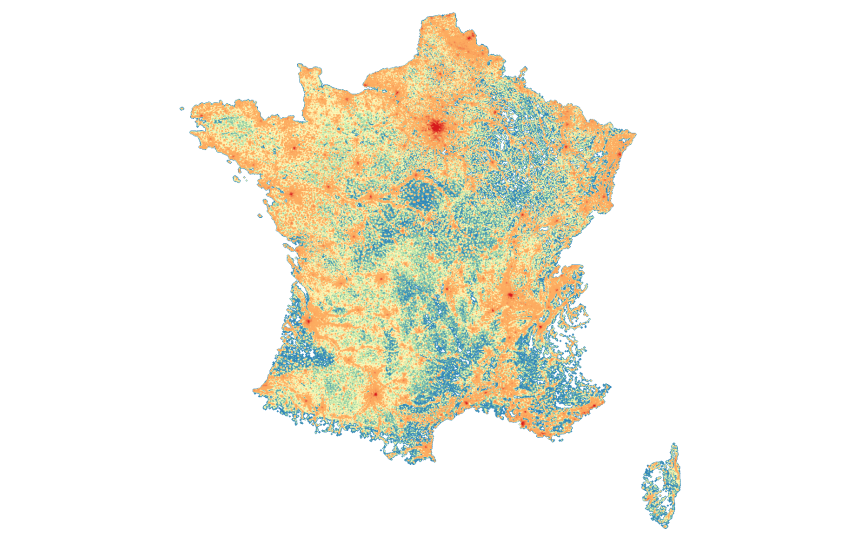
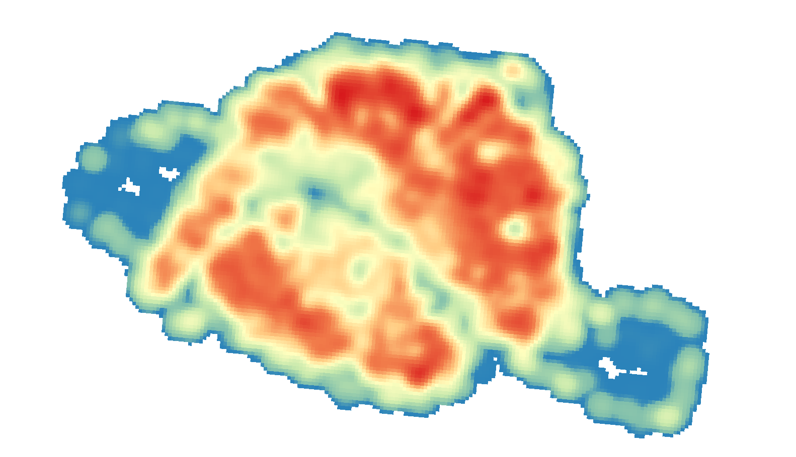

# h24

Yet another synthetic population generator.

## Install

```shell script
sbt publishLocal
```

## Generate a synthetic population for your study area

### Get Files for your study area
Run the getData.sh script.
```shell script
source getData.sh
```
It will:
- download the **CONTOURS-IRIS** files from http://professionnel.ign.fr/contoursiris for instance: https://wxs-telechargement.ign.fr/1yhlj2ehpqf3q6dt6a2y7b64/telechargement/inspire/CONTOURS-IRIS-FRANCE-2014-01-01$CONTOURS-IRIS_2-0__SHP_LAMB93_FXX_2014-01-01/file/CONTOURS-IRIS_2-0__SHP_LAMB93_FXX_2014-01-01.7z
- download **R_rfl09_LAEA1000** file from https://www.insee.fr/fr/statistiques/fichier/1405815/ECP1KM_09_MET.zip
- download **base-ic-evol-struct-pop** file from https://www.insee.fr/fr/statistiques/fichier/2028582/infra-population-2012.zip
- download **base-ic-diplomes-formation** file from https://www.insee.fr/fr/statistiques/fichier/2028265/infra-formation-2012.zip

You should now have a "data" directory with all the relevant data in it.
Note: We should have these files on IPFS very soon.

### Select the relevant data for your study area
- geographically for **CONTOURS-IRIS** and **R_rfl09_LAEA1000**
- by selection using *DEP*, *COM* or other relevant codes for **base-ic-evol-struct-pop** and **base-ic-diplomes-formation** (keep headers and everything, just filter the data)
- export the latter files as *CSV* and create *csv.lzma* files

This whole process can be automatically done using the following command:
```shell script
sbt "runMain eighties.h24.tools.ExtractRelevantData -c data/CONTOURS-IRIS_2-0__SHP_LAMB93_FXX_2014-01-01/CONTOURS-IRIS/1_DONNEES_LIVRAISON_2014/CONTOURS-IRIS_2-0_SHP_LAMB93_FE-2014/CONTOURS-IRIS_FE.shp -g data/GRID/R_rfl09_LAEA1000.shp -p data/base-ic-evol-struct-pop-2012.xls -f data/base-ic-diplomes-formation-2012.xls -d dep_list -o prepared_data"
```
Where *dep_list* is a list of "départements" you wish to extract from your data and *prepared_data* is the output directory.

For instance, the following command extracts the data for the 44 département (Loire Atlantique):
```shell script
sbt "runMain eighties.h24.tools.ExtractRelevantData -c data/CONTOURS-IRIS_2-0__SHP_LAMB93_FXX_2014-01-01/CONTOURS-IRIS/1_DONNEES_LIVRAISON_2014/CONTOURS-IRIS_2-0_SHP_LAMB93_FE-2014/CONTOURS-IRIS_FE.shp -g data/GRID/R_rfl09_LAEA1000.shp -p data/base-ic-evol-struct-pop-2012.xls -f data/base-ic-diplomes-formation-2012.xls -d 44 -o prepared_data_44"
```

The following command extracts the data for the entire Île-de-France région:
```shell script
sbt "runMain eighties.h24.tools.ExtractRelevantData -c data/CONTOURS-IRIS_2-0__SHP_LAMB93_FXX_2014-01-01/CONTOURS-IRIS/1_DONNEES_LIVRAISON_2014/CONTOURS-IRIS_2-0_SHP_LAMB93_FE-2014/CONTOURS-IRIS_FE.shp -g data/GRID/R_rfl09_LAEA1000.shp -p data/base-ic-evol-struct-pop-2012.xls -f data/base-ic-diplomes-formation-2012.xls -d 75,77,78,91,92,93,94,95 -o prepared_data_IDF"
```
The following command extracts the data for Metropolitan France:
```shell script
sbt "runMain eighties.h24.tools.ExtractRelevantData -c data/CONTOURS-IRIS_2-0__SHP_LAMB93_FXX_2014-01-01/CONTOURS-IRIS/1_DONNEES_LIVRAISON_2014/CONTOURS-IRIS_2-0_SHP_LAMB93_FE-2014/CONTOURS-IRIS_FE.shp -g data/GRID/R_rfl09_LAEA1000.shp -p data/base-ic-evol-struct-pop-2012.xls -f data/base-ic-diplomes-formation-2012.xls -o prepared_data"
```

You get the idea, right?

### You are ready to generate you synthetic population!
Let's keep our examples running. The parameters should look familiar.
For Loire-Atlantique:
```shell script
sbt "runMain eighties.h24.tools.PopulationGenerator -c prepared_data_44/CONTOURS-IRIS_FE.shp -g prepared_data_44/R_rfl09_LAEA1000.shp -s 1000 -p prepared_data_44/base-ic-evol-struct-pop-2012.csv.lzma -f prepared_data_44/base-ic-diplomes-formation-2012.csv.lzma -o results_44/population.bin"
```
For Île-de-France (note we added a JVM option to give more memory to the process):
```shell script
sbt -J-Xmx4G "runMain eighties.h24.tools.PopulationGenerator -c prepared_data_IDF/CONTOURS-IRIS_FE.shp -g prepared_data_IDF/R_rfl09_LAEA1000.shp -s 1000 -p prepared_data_IDF/base-ic-evol-struct-pop-2012.csv.lzma -f prepared_data_IDF/base-ic-diplomes-formation-2012.csv.lzma -o results_IDF/population.bin"
```
For Metropolitan France:
```shell script
sbt -J-Xmx8G "runMain eighties.h24.tools.PopulationGenerator -c prepared_data/CONTOURS-IRIS_FE.shp -g prepared_data/R_rfl09_LAEA1000.shp -s 1000 -p prepared_data/base-ic-evol-struct-pop-2012.csv.lzma -f prepared_data/base-ic-diplomes-formation-2012.csv.lzma -o results/population.bin"
```
### Export you synthetic population!
You can also export the population as a shapefile to see how it looks like.
For Île-de-France (note we added a JVM option to give more memory to the process):
```shell script
sbt -J-Xmx4G "runMain eighties.h24.tools.PopulationShapefileExporter -p results_IDF/population.bin -o results_IDF/population.shp"
```

For Metropolitan France, a shapefile will not work, you can use the geopackage exporter:
```shell script
sbt -J-Xmx8G "runMain eighties.h24.tools.PopulationGeopackageExporter -p results/population.bin -o results/population.gpkg"
```
And now, you have a Metropolitan France synthetic population!


### Generate and export a synthetic population in buildings
If you want to create a synthetic population in buildings, you can do so.
```shell script
sbt -J-Xmx4G "runMain eighties.h24.tools.PopulationInBuildingsGenerator -o results/populationInBuildings.gpkg -c prepared_data/CONTOURS-IRIS_FE.shp -b prepared_data/buildings.shp -p prepared_data/base-ic-evol-struct-pop-2012.csv.lzma -f prepared_data/base-ic-diplomes-formation-2012.csv.lzma"
```
To illustrate the results, here is a map of a population generated for Paris.

The heatmap of the same population with a radius of 500 meters.

The heatmap of the same area using the population grid from INSEE (with a radius of 500 meters).


## Let's use Origin-Destination data

### Step 1. Standardize OD Data
Get database from Origin-Destination survey. Following tables are necessary: trip database, people database, GIS database

You have to standardize trip database and people database issued from origin-destination surveys with Rscritps located in src/main/R

- For Loire-Atlantique-Nantes (dep 44), let's use EDGT 2015 (open data available here https://www.data.gouv.fr/fr/datasets/enquete-deplacements-en-loire-atlantique-2/) and run the standardize_OD_NantesRegion.R script
- For the Paris region (the whole Île-de-France), use EGT 2010 (if you have access to data) and run the standardize_OD_ParisRegion.R script

Whatever the region, you should get two tables: H24_trip.csv & H24_ind.csv

Notes
- Trip dataset is limited to weekday trips. We considered weekday trips as occurring an “average working day” (Monday to Friday)
- We kept trips occurring between 4:00 am (day before survey) and 3:59 am (day of survey) and removed trips outside this window.

### Step 2. Create location table from OD data
Secondly, run the generate_location.R script (located in src/main/R) 
You should get location table (H24_location.csv) with location of every respondent around the clock

Location attributes
- ZF_X & ZF_Y: coordinates: X Y – centroids of the area – projection L93
- CODE_ZF: ID of the area
- HEURE_DEB &  HEURE_FIN: start & end time (hh:mn)
- DUREE: duration (in minutes)
- MOTIF: home (1) ; work (2) ; study (3) ; shopping (4) ; leasure (5) ; others (6)

Respondent attributes
- RES_ZF_X &  RES_ZF_Y: coordinates X Y – centroids of the residential area – projection L93
- RES_ZF_CODE: ID of the residential area
- SEX: Male (1); Female (2)
- AGE: in years
- KAGE: Age in groups. 5-14 yrs (0); 15-29 yrs (1); 30-59 yrs (2); 60 yrs. and more (3)
- KEDUC: Educational level in groups (from their last achieved qualification). Low (no diploma - BEPC; CEP; BEP/CAP) (1) ; Middle (Bac-Bac+2) (2) ; Up (>Bac+2) (3). 
For respondents still at school, we defined their education level from their age : low for students less than 18 yrs.; middle for students between 18 and 24 yrs.; up for students aged 25 or more.

Notes :
- In the location table, transportation periods were removed.
- In the location table, respondents who reported staying at home all day (whatever the reason) were assigned to their place of residence over the entire observation period.

You can also directly download resulting location tables (in InputODData folder)
- for Loire-Atlantique (EDGT 2015):  H24_location_NantesRegion_noID.csv
- for the whole Île-de-France (EGT 2010): H24_location_ParisRegion_noID.csv

## Generate a move matrix

For Île-de-France (note we added a JVM option to give more memory to the process):
```shell script
unzip InputODData/H24_location_noID_ParisRegion.zip -d prepared_data_IDF/
lzma -f prepared_data_IDF/H24_location_noID_ParisRegion.csv
sbt -J-Xmx4G "runMain eighties.h24.tools.MoveMatrixGenerator -e prepared_data_IDF/H24_location_noID_ParisRegion.csv.lzma -s EPSG:27572 -p results_IDF/population.bin -m results_IDF/moves.bin"
```
For Loire-Atlantique (note we added a JVM option to give more memory to the process):
```shell script
sbt -J-Xmx4G "runMain eighties.h24.tools.MoveMatrixGenerator -e prepared_data_44/H24_location_noID_NantesRegion.csv.lzma -s EPSG:2154 -p results_44/population.bin -m results_44/moves.bin"
```

Please also note that we need to specify the SRID used in the input survey.

### Optionally, check your matrix
Generate the matrix destinations
```shell script
sbt -J-Xmx4G "runMain eighties.h24.tools.EGTShapefileExporter -p results_IDF/population.bin -m results_IDF/moves.bin -d true -o results_IDF/destinations.shp"
```
Generate the matrix origins
```shell script
sbt -J-Xmx4G "runMain eighties.h24.tools.EGTShapefileExporter -p results_IDF/population.bin -m results_IDF/moves.bin -d false -o results_IDF/origins.shp"
```
To see what the matrix looks like, you can generate a CSV file containing (parts of) the OD flows:
```shell script
sbt -J-Xmx4G "runMain eighties.h24.tools.EGTShapefileExporter -p results_IDF/population.bin -m results_IDF/moves.bin -o flowmap/flows.csv"
```
You can now see it if you open the index.html in you browser.
You can also filter the flows using a timeslice, sex, age, education & a percentile:
```shell script
sbt -J-Xmx4G "runMain eighties.h24.tools.EGTCSVExporter -p results_IDF/population.bin -m results_IDF/moves.bin -t 0 -a 1 -s 1 -e 1 -o flowmap/flows_0_1_1_1_0.5.csv"
```

### Run an "empty" Simulation
You can now run a simple 'empty' simulation with the test app.
For Île-de-France:
```shell script
sbt -J-Xmx2G "runMain eighties.h24.tools.SimulationApp -p results_IDF/population.bin -m results_IDF/moves.bin -d 1 -o maps_IDF"
```

For Loire-Atlantique:
```shell script
sbt -J-Xmx2G "runMain eighties.h24.tools.SimulationApp -p results_44/population.bin -m results_44/moves.bin -d 1 -o maps_44"
```
