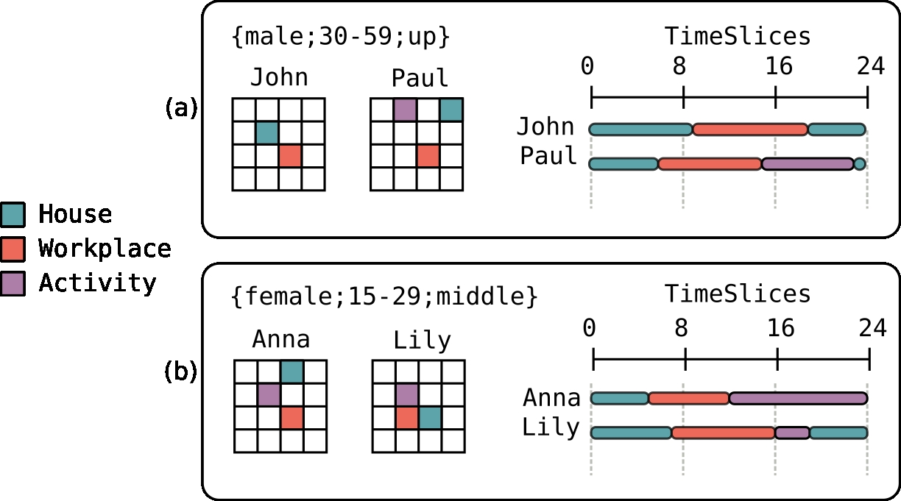
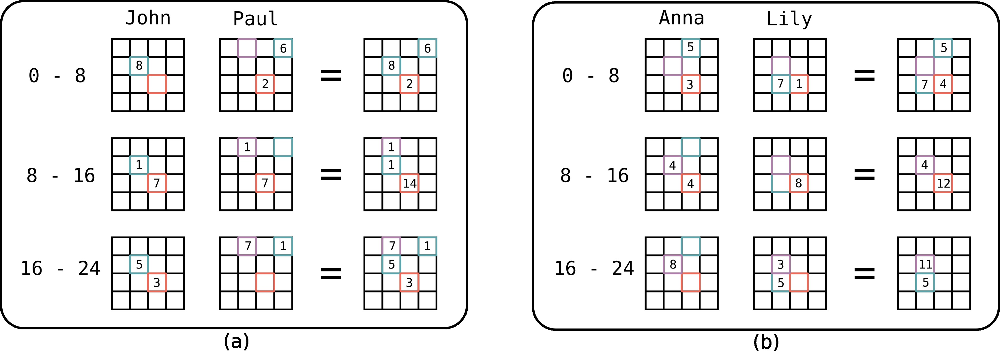
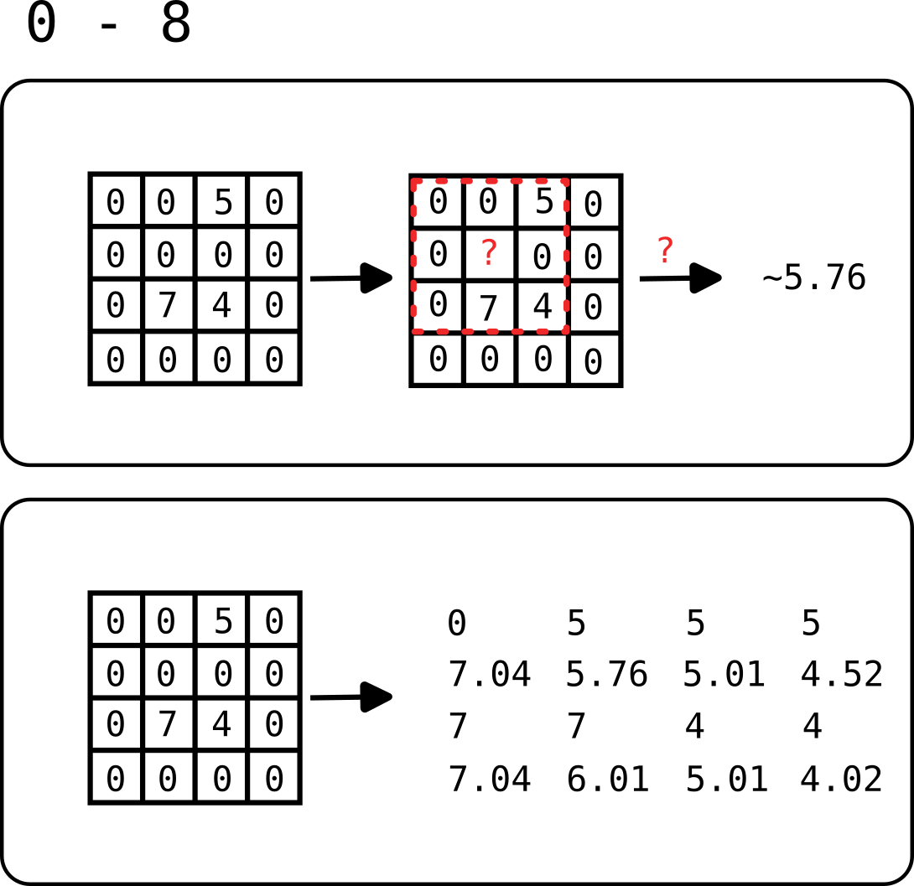

# Documentation about H24 library


## Step 1 Generating population

Initial distribution of population (`population.bin`) is generated using the `PopulationGenerator` tools Object with correct input parameters/data :

{{ code_from_file("../src/main/scala/eighties/h24/generation.scala", 365, 373, "scala") }}

!!! note "Parameters of `eighties.h24.tools.PopulationGenerator`"

    -  `c` shape of Iris,
    -  `p` & `f` population structure and education from census,
    -  `g` population density in raster format,
    -  `s` grid size for population projection
    -  `r` if you want a random population

Given population density we build a matrix of cells.

Next, the function `generation.generatePopulationRandomly` (generation.scala) use information about structure of population (age, sex, education) at the census block level (iris) to sample new population sized individuals using direct sampling algorithm.

{{ code_from_file("../src/main/scala/eighties/h24/generation.scala", 74, 78, "scala") }}

We don't consider the census block geometries, so we attribute for each individual (`IndividualFeature`) a random cell in a matrix of same size of the population raster grid. This random cell is taken using a multinomial to respect density of population.

Finally, individuals (x,y) are translated/relocated to some new grid of cells function of the `gridSize` parameter.

## Step 2 Move population

### Understanding the "Big Picture"

#### Building AggregatedCategories

We take a simple example extracted from a very simple EGT with only four people and a 4*4 grid of places.



We start by building our aggregated categories using h24 `social.scala` package, using fine category described by EGT : 

- John is a male of 24 years, with education coded as SUP
- Paul is a male of 39 years, with education coded as SUP

In h24 John and Paul are grouped in the same `aggregatedCategory` : {gender male ;30-59 years ;up education}  

If we look the grid we see the different places and activities that John, Paul practice for one day. We read this graphic like that : 

- John stay at home (1,1) between 0h and 9h, then go to workplace (2,2) between 9h and 19h, and go back to home (1,1) at 19h. 
- Paul stay at home (2,2) between 0h and 6h, then go to workplace (3,0) between 6h and 15h, practice an activity (1,0) between 15h and 23h, then go back to home (2,2) at 23h.

Now, if we look at (b) :

- Anna is a female of 22 years, with education coded as BAC
- Lily is a female of 26 years, with education coded as BACP2

We apply the same algorithm for Anna and Lily that are grouped in the same `aggregatedCategory` : {gender female ;15-29 years ;middle education}

We read the Timeslice and the Matrix of places and activities like (a).

#### Building moves for AggregatedCategory



In this next step algorithm build move for each AggregatedCategory. To do that, we cumulate the time spent by each individual by cutting it into three time slice.

If we look at (a) : 

- In the first [0h - 8h] time slice : 
  - John stay at home during 8h in (1,1);
  - Paul stay at home during 6h in (0,3) and go to work during 2h in (2,2)
  
  **=> for this time slice we aggregate these numbers in a list of [((place),hour);...]** : [((2,2),8); ((0,3),6); ((2,2),2)]

- In the second [8h - 16h] time slice :
  - John stay at home during 1h in (1,1) then go to work 7h in (2,2)
  - Paul stay at work during 7h in (2,2) then go to activity 1h in (0,1)

  **=> for this time slice we aggregate these numbers in a list of [((place),hour);...]** : [((0,1),1); ((1,1),1); ((2,2),14)]

- In the third [16h - 24h] time slice :
  - John stay at work during 3h in (2,2) then go to home 5h in (1,1)
  - Paul stay at activy during 7h in (0,1) then go to home 1h in (0,3)

  **=> for this time slice we aggregate these numbers in a list of [((place),hour);...]** : [((0,1),7); ((0,3),1); ((1,1),5), ((2,2),3)]

These three list encode the `Moves` made by people of `AggregatedCategory {gender male ;30-59 years ;up education}` to `Cells` for each `Time Slice`. 

We use the same algorithm for the other `AggregatedCategory` in (b)

### Interpolate 

ECG contain only a small parts of the real population. We use a simple IDW (Inverse Distance Weighting) interpolation to compute values for all cells that contain actually no moves.



If we consider starting from centroid of each cell : foulée.

- distance of 1 for horizontal and vertical move 
- distance of 1.41 for diagonal move

In we compute the interpolated value for cell (1,1), with power 2, the computation with precision of 2 is :

((5/(1.41^2)) + (7/(1^2)) + (4/(1.41^2))) / ((1/(1.41^2)) + (1/(1^2)) + (1/(1.41^2))) ~= 5.76

You could also see in this figure the generalisation of the computation with a precision of 2.

### Understanding source code in detail

Using EGT and population previously generated, flows are precomputed as File (`move.bin`) before running simulation.

In `generation.scala` , in `flowsFromEgt(...)` the method `readFlowsFromEGT()` return an `Array[Flow]`

We build a `MoveMatrix` (in reality a `Vector[TimeSlice, CellsMatrix]`) where `CellsMatrix` is an `Array[Array[Cell]]`  :

- A `Move` is an object with an index and a ratio.
- A `Cell` is a Map which associate an `AggregatedCategory` with an array of `Move`
- An `AggregatedCategory` object take a category (ex.`Education.SUP`) as input and return the coresponding aggregated category (ex. `HIGH`)
- A TimeSlice is a vector of TimeSlices (0-8,8-16,16-24) :
    - (0-8) - Empty Map for each Cell in Matrix
    - (8-16) - Empty Map for each Cell in Matrix
    - (16-24) - Empty Map for each Cell in Matrix

We first build a vector of `MoveMatrix` with empty array of Move for AggregatedCategory.

For each `TimeSlice` by reading flows from EGT file (`Array[Flow]`) and aggregate them by Cell (`addFlowToCell` function).

```
  for each nm in `Vector[TimeSlice, CellsMatrix]`  
   for each flow f in EGT  
     a) we get the Cell c at (x,y) of residence of current flow 
     b) we update these Cell c by calling addFlowToCell() function
``` 

The `addFlowToCell()` function add the contribution of a flow to `Cell` for a given timeslice by :
- computing the length of intersection between first `mn` timeslice and `f` timeslice.
- attributing an aggregated category `cat` to this flow.
- calculating :
    - if intersection is 0, cell `c` is not updated
    - else we create or update the `Array[Move]` for this `cat` .
    - If a `Move` already exist for the activity location of this flow, we update this Move by adding our contribution.

```scala
  def addFlowToCell(c: Cell, flow: Flow, timeSlice: TimeSlice): Cell = {
    val intersection = overlap(flow.timeSlice, timeSlice).toDouble
    val cat = AggregatedSocialCategory(SocialCategory(age = flow.age, sex = flow.sex, education = flow.education))

    if(intersection <= 0.0) c
    else
      c.get(cat) match {
        case Some(moves) =>
          val index = moves.indexWhere { m => Move.location.get(m) == flow.activity }
          if (index == -1) c + (cat -> moves.:+ (Move(flow.activity, intersection.toFloat)))
          else {
            val v = MoveMatrix.Move.ratio.get(moves(index))
            c + (cat -> moves.updated(index, Move(flow.activity, v + intersection.toFloat)))
          }
        case None =>
          c + (cat -> Array(Move(flow.activity, intersection.toFloat)))
      }
  }
```

After that, MoveMatrix is interpolated (`interpolate(...)`) then normalized (`normalizedFlows(...)`).

Because EGT flows are a small parts of real flow, we scale MoveMatrix CellsMatrix build using EGT at IDF level by interpolating values to neighbors. Each CellsMatrix could be interpreted as a probability by category at individual level.

To normalize CellsMatrix, we use `getMovesFromOppositeSex(...)`: in order to get more samples in areas where we have little information, we also use the information from samples in the area with the same categories but different sex


## Step 2 Simulating


- Chargement de `results/population.bin`   (ageCategory, sexe, education ) dans un vecteur d' `IndividualFeature`
- fct `generateWorld` :
    - `IndividualFeature` sont rewrappés dans des case class Age, Sexe, Education, Comportement, Lieu dans `Individual`
    - On filtre cette population en fonction du prédicat de la fonction `included`
    - Genere le monde `World` en fonction du vecteur `Individual`, fonction comportement de type `Behaviour` (double) et une graine  aléatoire. 
 


